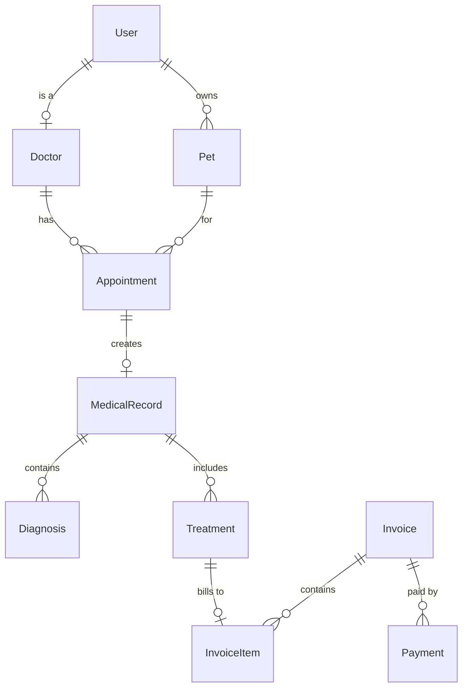
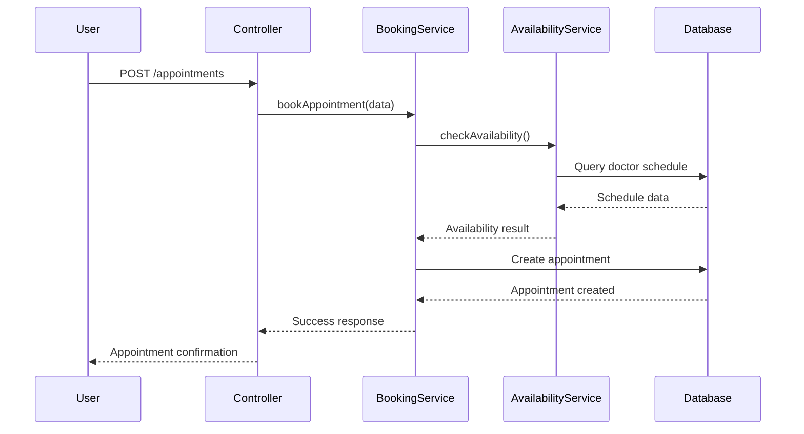
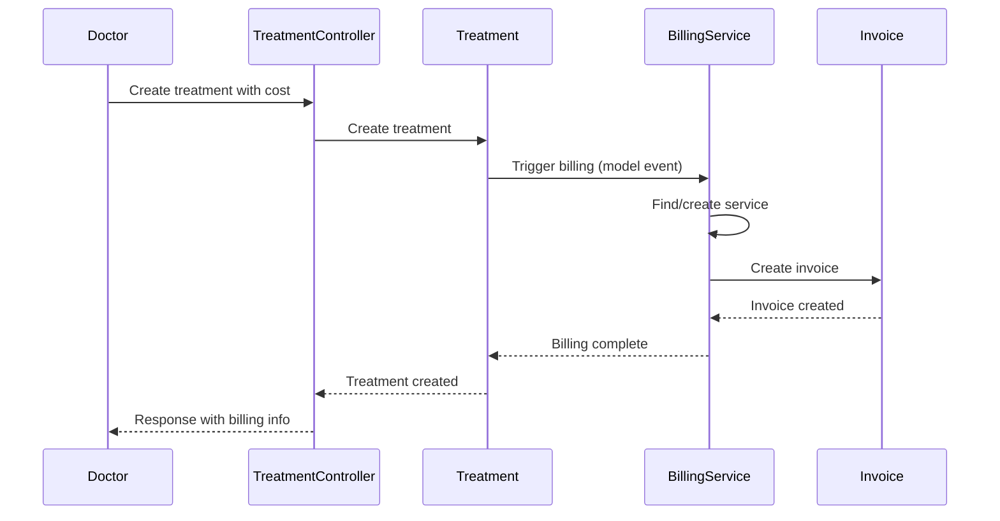

# 🏗️ VetCare System Architecture

## 🎯 **Overview**

VetCare is a comprehensive veterinary management system built with Laravel 10, following clean architecture principles and modern development practices. The system provides role-based access control, appointment booking, medical record management, and integrated billing functionality.

## 🏛️ **Architecture Patterns**

### **Clean Architecture**
The application follows clean architecture principles with clear separation of concerns:

```
┌─────────────────────────────────────────────────────────────┐
│                    Presentation Layer                       │
│  Controllers, DTOs, Request/Response Handling              │
├─────────────────────────────────────────────────────────────┤
│                    Business Logic Layer                     │
│  Services, Domain Logic, Business Rules                    │
├─────────────────────────────────────────────────────────────┤
│                    Data Access Layer                        │
│  Models, Repositories, Database Interactions               │
├─────────────────────────────────────────────────────────────┤
│                    Infrastructure Layer                     │
│  Database, External APIs, File Storage                     │
└─────────────────────────────────────────────────────────────┘
```

### **Domain-Driven Design (DDD)**
The system is organized around business domains:

- **User Management**: Authentication, authorization, user profiles
- **Appointment Management**: Booking, scheduling, availability
- **Medical Management**: Records, diagnoses, treatments, documents
- **Billing Management**: Services, invoices, payments
- **Pet Management**: Pet profiles, ownership, medical history

## 📁 **Directory Structure**

```
app/
├── Core/                           # Core utilities and helpers
│   └── Helpers/
│       └── ResponseHelper.php      # Standardized API responses
├── Data/                           # Data Transfer Objects (DTOs)
│   └── Appointments/               # Appointment-specific DTOs
├── Enums/                          # Application enumerations
├── Exceptions/                     # Custom exception classes
├── Http/
│   └── Controllers/
│       ├── Admin/                  # Admin-specific controllers
│       ├── Doctor/                 # Doctor-specific controllers
│       └── User/                   # User-specific controllers
├── Models/                         # Eloquent models
├── Providers/                      # Service providers
├── Rules/                          # Custom validation rules
└── Services/                       # Business logic services
```

## 🔧 **Core Components**

### **1. Authentication & Authorization**

**Technology Stack:**
- Laravel Sanctum for API authentication
- Spatie Laravel Permission for role-based access control

**Roles:**
- `admin`: Full system access
- `doctor`: Medical professional access
- `user`: Pet owner access

**Implementation:**
```php
// Middleware usage
Route::middleware(['auth:sanctum', 'role:admin'])->group(function () {
    // Admin routes
});

Route::middleware(['auth:sanctum', 'role:doctor'])->group(function () {
    // Doctor routes
});
```

### **2. Data Transfer Objects (DTOs)**

**Technology:** Spatie Laravel Data package

**Purpose:**
- Type-safe data validation
- Consistent API request/response structure
- Automatic documentation generation

**Example:**
```php
class BookAppointmentData extends Data
{
    public function __construct(
        public int $doctor_id,
        public int $pet_id,
        public string $date,
        public string $time,
        public int $duration,
        public string $appointment_type,
        public ?string $notes = null,
    ) {}
}
```

### **3. Service Layer**

**Purpose:** Encapsulate business logic and complex operations

**Key Services:**
- `AppointmentBookingService`: Appointment creation and validation
- `DoctorAvailabilityService`: Doctor schedule management
- `TreatmentBillingService`: Automatic treatment billing
- `AppointmentCalendarService`: Calendar and availability logic

### **4. Response Standardization**

**ResponseHelper Class:**
```php
class ResponseHelper
{
    public static function success($message, $data = null, $statusCode = 200)
    public static function error($message, $statusCode = 400, $errors = null)
    public static function validationError($errors, $message = 'Validation failed')
}
```

**Standard Response Format:**
```json
{
  "success": true,
  "message": "Operation completed successfully",
  "data": { ... },
  "errors": null
}
```

## 🗄️ **Database Design**

### **Core Tables**

#### **User Management**
- `users`: User accounts and basic information
- `model_has_roles`: Role assignments (Spatie)
- `permissions`: System permissions (Spatie)

#### **Medical Domain**
- `doctors`: Doctor profiles and specializations
- `pets`: Pet information and owner relationships
- `appointments`: Appointment scheduling
- `medical_records`: Visit records and medical history
- `diagnoses`: Medical diagnoses
- `treatments`: Treatment plans and medications
- `medical_documents`: File attachments and medical documents

#### **Billing Domain**
- `services`: Billable veterinary services
- `invoices`: Billing documents
- `invoice_items`: Individual services on invoices
- `payments`: Payment records and transactions

### **Relationship Patterns**



## 🔄 **Business Logic Flows**

### **Appointment Booking Flow**



### **Automatic Treatment Billing Flow**



## 🛡️ **Security Architecture**

### **Authentication Security**
- API token-based authentication (Sanctum)
- Token expiration and rotation
- Rate limiting on authentication endpoints

### **Authorization Security**
- Role-based access control (RBAC)
- Resource ownership validation
- Route-level permission checking

### **Data Security**
- Input validation using DTOs and Form Requests
- SQL injection prevention (Eloquent ORM)
- File upload security with type validation
- Sensitive data encryption

### **API Security**
- CORS configuration
- Request rate limiting
- Input sanitization
- Error message sanitization

## 📊 **Performance Considerations**

### **Database Optimization**
- Proper indexing on foreign keys and search fields
- Eager loading to prevent N+1 queries
- Database query optimization
- Pagination for large datasets

### **Caching Strategy**
- Model caching for frequently accessed data
- Route caching for production
- Configuration caching
- View caching where applicable

### **API Performance**
- Response compression
- Efficient serialization
- Minimal data transfer
- Optimized query patterns

## 🔧 **Development Patterns**

### **Repository Pattern**
While not explicitly implemented, the service layer acts as a repository abstraction:

```php
class AppointmentBookingService
{
    public function bookAppointment(BookAppointmentData $data): Appointment
    {
        // Business logic here
        return Appointment::create($validatedData);
    }
}
```

### **Factory Pattern**
Used for test data generation and model creation:

```php
class DoctorFactory extends Factory
{
    public function definition(): array
    {
        return [
            'specialization' => $this->faker->randomElement([
                'General Veterinarian',
                'Emergency Veterinarian',
                // ...
            ]),
        ];
    }
}
```

### **Observer Pattern**
Model events for automatic actions:

```php
class Treatment extends Model
{
    protected static function boot()
    {
        parent::boot();
        
        static::created(function ($treatment) {
            if ($treatment->cost && $treatment->cost > 0) {
                app(TreatmentBillingService::class)
                    ->createInvoiceForTreatment($treatment);
            }
        });
    }
}
```

## 🚀 **Deployment Architecture**

### **Environment Configuration**
- Development: Local SQLite database
- Staging: MySQL with test data
- Production: MySQL with backup strategy

### **File Storage**
- Local storage for development
- Cloud storage (S3) for production
- Medical document encryption

### **Queue System**
- Database queues for development
- Redis/SQS for production
- Background job processing for:
  - Email notifications
  - File processing
  - Report generation

## 📈 **Scalability Considerations**

### **Horizontal Scaling**
- Stateless API design
- Database connection pooling
- Load balancer compatibility

### **Vertical Scaling**
- Efficient memory usage
- Optimized database queries
- Minimal resource consumption

### **Microservices Readiness**
- Domain separation
- Service layer abstraction
- API-first design
- Independent deployability

## 🔍 **Monitoring & Logging**

### **Application Logging**
- Structured logging with context
- Error tracking and alerting
- Performance monitoring
- Business event logging

### **Database Monitoring**
- Query performance tracking
- Connection pool monitoring
- Slow query identification
- Database health checks

### **API Monitoring**
- Response time tracking
- Error rate monitoring
- Endpoint usage analytics
- Rate limit monitoring

## 🧪 **Testing Strategy**

### **Test Types**
- Unit tests for services and models
- Feature tests for API endpoints
- Integration tests for complex workflows
- Database tests for data integrity

### **Test Data Management**
- Factory-based test data generation
- Seeders for consistent test environments
- Database transactions for test isolation
- Mock external dependencies

## 📚 **Documentation Strategy**

### **API Documentation**
- Endpoint documentation with examples
- Request/response schemas
- Error code documentation
- Authentication requirements

### **Code Documentation**
- PHPDoc comments for all public methods
- Inline comments for complex logic
- README files for major components
- Architecture decision records (ADRs)

---

This architecture provides a solid foundation for a scalable, maintainable veterinary management system with clear separation of concerns and modern development practices. 