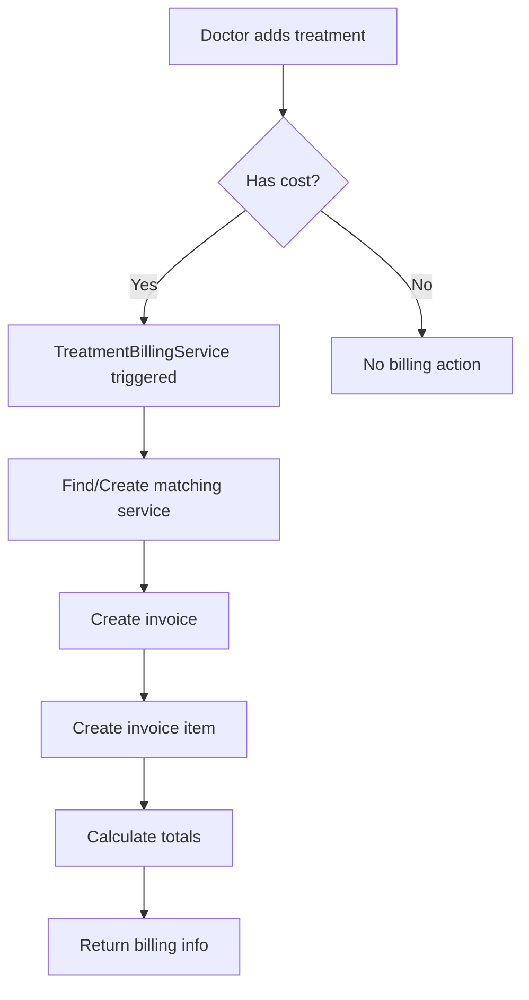
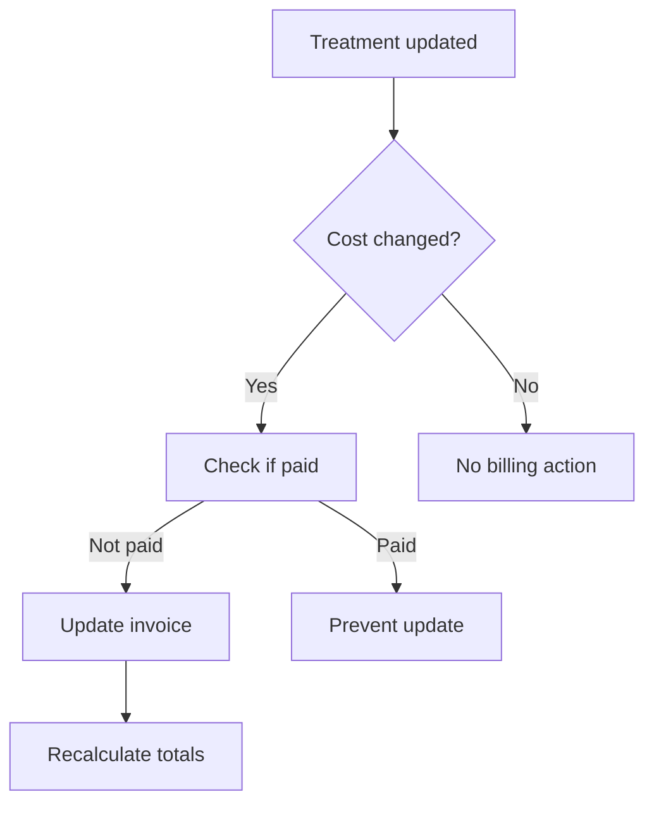
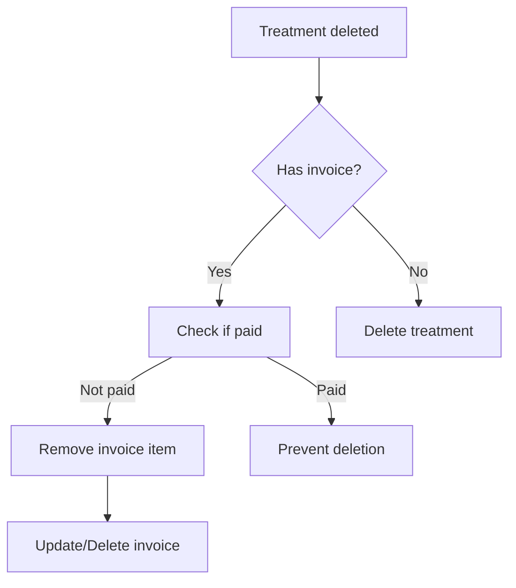

# 🏥💰 Automatic Treatment Billing System

## 🎯 **Overview**

The VetCare application now includes **automatic invoice generation** when payable treatments are added to medical records. This system seamlessly integrates medical care with billing, ensuring that all chargeable treatments are automatically billed without manual intervention.

## ⚡ **Key Features**

### **Automatic Invoice Generation**
- ✅ **Instant Billing**: Invoices are created automatically when treatments with costs are added
- ✅ **Service Mapping**: Treatments are automatically mapped to billing services
- ✅ **Cost Tracking**: Treatment costs are directly reflected in invoices
- ✅ **Smart Updates**: Invoice amounts update when treatment costs change
- ✅ **Payment Protection**: Prevents changes to paid treatments

### **Treatment-to-Service Integration**
- 🔄 **Auto-Service Creation**: Creates billing services for new treatment types
- 🏷️ **Billing Code Mapping**: Links treatments to existing services via billing codes
- 📊 **Category Mapping**: Maps treatment types to appropriate service categories
- 💡 **Smart Naming**: Generates meaningful service names from treatment details

### **Business Logic Protection**
- 🛡️ **Payment Validation**: Cannot modify/delete treatments that have been paid
- 🔒 **Cost Change Control**: Prevents cost changes on invoiced treatments with payments
- 📋 **Audit Trail**: Complete logging of automatic billing actions
- ⚠️ **Error Handling**: Graceful handling of billing failures

## 🏗️ **System Architecture**

### **Core Components**

#### **1. TreatmentBillingService**
```php
app/Services/TreatmentBillingService.php
```
- Handles automatic invoice creation for treatments
- Maps treatments to billing services
- Manages invoice updates and deletions
- Provides business logic for billing operations

#### **2. Treatment Model Events**
```php
app/Models/Treatment.php
```
- **Created Event**: Triggers invoice creation for payable treatments
- **Updated Event**: Updates invoices when treatment costs change
- **Deleting Event**: Removes invoices when treatments are deleted

#### **3. Treatment Controllers**
```php
app/Http/Controllers/Doctor/TreatmentController.php
app/Http/Controllers/Admin/TreatmentController.php
```
- Provide CRUD operations for treatments
- Include billing information in responses
- Handle treatment status updates

## 🔄 **Automatic Billing Workflow**

### **1. Treatment Creation**


### **2. Treatment Update**


### **3. Treatment Deletion**


## 📊 **Treatment-to-Service Mapping**

### **Treatment Types → Service Categories**
```php
'medication' => 'treatment'
'procedure' => 'treatment'
'surgery' => 'surgery'
'therapy' => 'treatment'
'vaccination' => 'vaccination'
'diagnostic_test' => 'diagnostic'
'other' => 'treatment'
```

### **Service Name Generation**
1. **Treatment Name** (if provided)
2. **Medication Name** → "Medication: {name}"
3. **Procedure Code** → "Procedure: {code}"
4. **Fallback** → "{Type} Treatment"

### **Service Code Assignment**
1. **Billing Code** (if provided in treatment)
2. **Auto-generated** → "{CATEGORY}-{NAME}-{NUMBER}"

## 🔗 **API Endpoints**

### **Doctor Treatment Management**
```bash
# List doctor's treatments with billing info
GET /api/doctor/treatments

# Create treatment (auto-bills if cost provided)
POST /api/doctor/treatments
{
  "medical_record_id": 1,
  "type": "medication",
  "name": "Antibiotics",
  "cost": 45.00,
  "billing_code": "MED-001"
}

# Get treatment with billing details
GET /api/doctor/treatments/{treatment}

# Update treatment (auto-updates billing)
PUT /api/doctor/treatments/{treatment}

# Get treatments for medical record
GET /api/doctor/treatments/medical-record/{medicalRecord}

# Mark as administered/completed
PATCH /api/doctor/treatments/{treatment}/administered
PATCH /api/doctor/treatments/{treatment}/completed
```

### **Admin Treatment Management**
```bash
# List all treatments with billing info
GET /api/admin/treatments

# Create treatment for any medical record
POST /api/admin/treatments

# Get treatment statistics
GET /api/admin/treatments/statistics

# Get treatments by doctor/pet
GET /api/admin/treatments/doctor/{doctor}
GET /api/admin/treatments/pet/{pet}

# Bulk status update
PATCH /api/admin/treatments/bulk-status
```

## 💻 **Frontend Implementation Examples**

### **Creating a Payable Treatment**
```javascript
// Create treatment with automatic billing
const createTreatment = async (treatmentData) => {
  const response = await fetch('/api/doctor/treatments', {
    method: 'POST',
    headers: {
      'Content-Type': 'application/json',
      'Authorization': `Bearer ${token}`
    },
    body: JSON.stringify({
      medical_record_id: treatmentData.medicalRecordId,
      type: treatmentData.type,
      name: treatmentData.name,
      cost: treatmentData.cost, // This triggers automatic billing
      billing_code: treatmentData.billingCode,
      // ... other treatment fields
    })
  });
  
  const result = await response.json();
  
  if (result.data.billing_info) {
    console.log('Invoice created automatically:', result.data.billing_info);
    // Show billing information to user
    showBillingNotification(result.data.billing_info);
  }
  
  return result;
};

const showBillingNotification = (billingInfo) => {
  alert(`Invoice ${billingInfo.invoice_number} created automatically for $${billingInfo.amount}`);
};
```

### **Treatment List with Billing Status**
```javascript
const TreatmentList = ({ treatments }) => {
  return (
    <div className="treatment-list">
      {treatments.map(treatment => (
        <div key={treatment.id} className="treatment-card">
          <div className="treatment-info">
            <h3>{treatment.name}</h3>
            <p>Type: {treatment.type}</p>
            <p>Status: {treatment.status}</p>
            {treatment.cost && (
              <p>Cost: ${treatment.cost}</p>
            )}
          </div>
          
          {treatment.billing_info && (
            <div className="billing-info">
              <span className="billing-badge">
                📄 Invoice: {treatment.billing_info.invoice_number}
              </span>
              <span className={`payment-status ${treatment.billing_info.payment_status}`}>
                {treatment.billing_info.payment_status}
              </span>
            </div>
          )}
          
          {!treatment.billing_info && treatment.cost > 0 && (
            <div className="billing-warning">
              ⚠️ Billing pending
            </div>
          )}
        </div>
      ))}
    </div>
  );
};
```

### **Treatment Cost Update with Billing Protection**
```javascript
const updateTreatmentCost = async (treatmentId, newCost) => {
  try {
    const response = await fetch(`/api/doctor/treatments/${treatmentId}`, {
      method: 'PUT',
      headers: {
        'Content-Type': 'application/json',
        'Authorization': `Bearer ${token}`
      },
      body: JSON.stringify({ cost: newCost })
    });
    
    const result = await response.json();
    
    if (response.ok) {
      if (result.message.includes('invoice updated')) {
        showNotification('Treatment cost updated and invoice adjusted automatically');
      }
      return result;
    } else {
      // Handle billing protection errors
      if (result.message.includes('has been paid')) {
        showError('Cannot change cost of treatment that has been paid');
      }
      throw new Error(result.message);
    }
  } catch (error) {
    console.error('Failed to update treatment cost:', error);
    throw error;
  }
};
```

## 🔒 **Business Rules & Validations**

### **Automatic Billing Rules**
1. **Cost Requirement**: Only treatments with `cost > 0` trigger billing
2. **Duplicate Prevention**: Won't create multiple invoices for same treatment
3. **Service Reuse**: Reuses existing services when possible
4. **Auto-Service Creation**: Creates new services for unique treatments

### **Payment Protection Rules**
1. **Paid Treatments**: Cannot modify cost or delete paid treatments
2. **Invoice Integrity**: Maintains invoice consistency
3. **Audit Trail**: Logs all billing operations
4. **Error Recovery**: Graceful handling of billing failures

### **Update Scenarios**
| Scenario | Action | Result |
|----------|--------|--------|
| Add cost to free treatment | Create invoice | New invoice generated |
| Increase treatment cost | Update invoice | Invoice amount increased |
| Decrease treatment cost | Update invoice | Invoice amount decreased |
| Remove cost (set to 0) | Remove invoice item | Invoice item deleted |
| Update paid treatment cost | Block update | Error returned |
| Delete paid treatment | Block deletion | Error returned |

## 📈 **Monitoring & Analytics**

### **Treatment Statistics**
```bash
GET /api/admin/treatments/statistics
```

**Returns:**
- Total treatments count
- Payable treatments count
- Billed treatments count
- Total treatment revenue
- Treatments by type/status
- Monthly treatment trends
- Top medications/procedures

### **Billing Integration Metrics**
- **Auto-billing Success Rate**: Percentage of successful automatic billings
- **Service Creation Rate**: How often new services are auto-created
- **Revenue from Treatments**: Total revenue generated from treatment billing
- **Payment Protection Triggers**: How often payment protection prevents changes

## 🚀 **Getting Started**

### **1. Enable Automatic Billing**
The system is automatically enabled when treatments are created with costs.

### **2. Test the System**
```bash
# Create a payable treatment
curl -X POST "/api/doctor/treatments" \
  -H "Authorization: Bearer YOUR_TOKEN" \
  -H "Content-Type: application/json" \
  -d '{
    "medical_record_id": 1,
    "type": "medication",
    "name": "Pain Relief Medication",
    "cost": 25.50,
    "start_date": "2024-01-15"
  }'

# Check if invoice was created automatically
curl -X GET "/api/doctor/treatments/1" \
  -H "Authorization: Bearer YOUR_TOKEN"
```

### **3. Monitor Billing Activity**
```bash
# Check treatment statistics
curl -X GET "/api/admin/treatments/statistics" \
  -H "Authorization: Bearer YOUR_TOKEN"

# View auto-generated invoices
curl -X GET "/api/admin/invoices?search=auto-generated" \
  -H "Authorization: Bearer YOUR_TOKEN"
```

## 🔧 **Configuration Options**

### **Service Auto-Creation Settings**
```php
// In TreatmentBillingService
'is_active' => true,              // Auto-created services are active
'requires_appointment' => false,   // Treatments don't require appointments
'tags' => ['auto-generated', 'treatment-based']  // Identification tags
```

### **Invoice Settings**
```php
'due_date' => now()->addDays(30),  // 30-day payment terms
'tax_rate' => 0,                   // No tax by default (configurable)
'notes' => "Auto-generated invoice for treatment: {name}"
```

## 🐛 **Troubleshooting**

### **Common Issues**

#### **Invoice Not Created**
- ✅ Check if treatment has cost > 0
- ✅ Verify TreatmentBillingService is registered
- ✅ Check application logs for errors

#### **Service Creation Failed**
- ✅ Verify services table exists
- ✅ Check for unique constraint violations
- ✅ Ensure proper permissions

#### **Cannot Update Treatment Cost**
- ✅ Check if treatment has been paid
- ✅ Verify invoice payment status
- ✅ Use admin override if necessary

### **Debug Commands**
```bash
# Check if treatment is billed
php artisan tinker
>>> $treatment = Treatment::find(1);
>>> $treatment->isBilled();
>>> $treatment->invoice();

# Check billing service logs
tail -f storage/logs/laravel.log | grep "TreatmentBilling"
```

## 📞 **Support**

For issues with automatic treatment billing:
1. Check the application logs
2. Verify database integrity
3. Test with simple treatment creation
4. Contact development team with specific error details

---

**🎉 Happy Automatic Billing! The system now seamlessly handles treatment-to-invoice generation, making veterinary billing effortless and accurate.** 